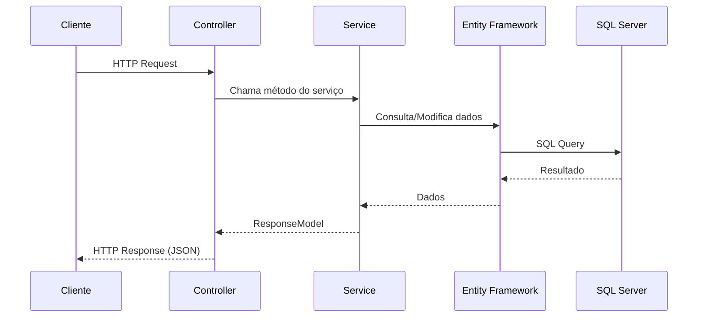
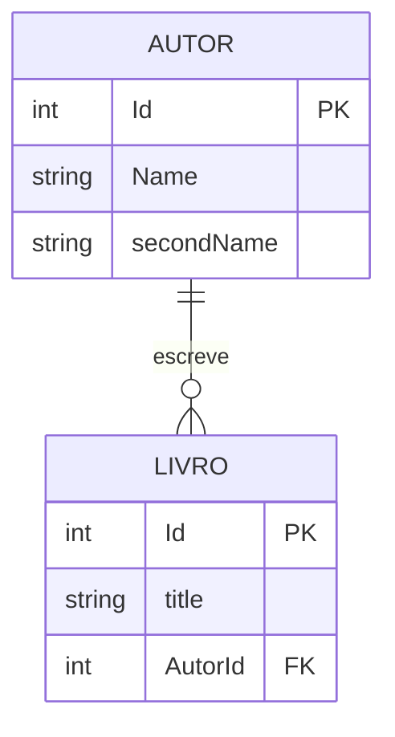

# 📚 WebAPI Livro e Autor

API REST desenvolvida em **ASP.NET Core 8.0** para gerenciamento de **Livros** e **Autores**, utilizando **Entity Framework Core** e **SQL Server**.

## 📋 Sumário Executivo

Esta API fornece endpoints RESTful completos para operações CRUD (Create, Read, Update, Delete) em duas entidades principais:
- **Autores**: Gerenciamento de informações de autores
- **Livros**: Gerenciamento de livros com relacionamento com autores

### Tecnologias Utilizadas

- **.NET 8.0** - Framework principal
- **ASP.NET Core Web API** - Framework para construção de APIs REST
- **Entity Framework Core 8.0.3** - ORM para acesso a dados
- **SQL Server** - Banco de dados relacional
- **Swagger/OpenAPI** - Documentação interativa da API

---

## 🚀 Como Iniciar o Projeto

### Pré-requisitos

Antes de começar, certifique-se de ter instalado:

- [.NET 8.0 SDK](https://dotnet.microsoft.com/download/dotnet/8.0) ou superior
- [SQL Server](https://www.microsoft.com/sql-server/sql-server-downloads) (instância local ou remota)
- [Visual Studio 2022](https://visualstudio.microsoft.com/) ou [VS Code](https://code.visualstudio.com/)
- [Git](https://git-scm.com/) (para clonar o repositório)

### Instalação

1. **Clone o repositório**
   ```bash
   git clone https://github.com/DevHerbertt/WEBAPI-livroAutor.git
   cd WEBAPI-livroAutor/WebAPI
   ```

2. **Restaurar dependências**
   ```bash
   dotnet restore
   ```

3. **Configurar Connection String**
   
   Edite o arquivo `appsettings.json` e ajuste a connection string conforme seu ambiente:
   ```json
   {
     "ConnectionStrings": {
       "DefaultConnection": "Server=DEV\\SQLEXPRESS01;Database=WebApiAulaVideo;Trusted_Connection=True;TrustServerCertificate=true"
     }
   }
   ```
   
   **Importante**: Ajuste o nome do servidor (`DEV\\SQLEXPRESS01`) e o nome do banco de dados (`WebApiAulaVideo`) conforme sua configuração.

4. **Executar Migrations**
   ```bash
   dotnet ef database update
   ```
   
   Isso criará o banco de dados e as tabelas necessárias automaticamente.

5. **Executar o Projeto**
   ```bash
   dotnet run
   ```

6. **Acessar a API**
   
   Após iniciar, a API estará disponível em:
   - **HTTP**: `http://localhost:5174`
   - **HTTPS**: `https://localhost:7171`
   - **Swagger UI**: `http://localhost:5174/swagger` ou `https://localhost:7171/swagger`

---

## 📊 Estrutura do Projeto

```
WebAPI/
├── Controllers/              # Controllers da API REST
│   ├── AutorController.cs    # Endpoints para Autores
│   └── LivroController.cs    # Endpoints para Livros
├── Data/                     # Camada de acesso a dados
│   └── AppDBContext.cs       # DbContext do Entity Framework
├── DTO/                      # Data Transfer Objects
│   ├── DTOAutor.cs           # DTO para criação de Autor
│   ├── DTOAutorEditar.cs     # DTO para edição de Autor
│   ├── DTOLivro.cs           # DTO para criação de Livro
│   └── DTOLIvroEditar.cs     # DTO para edição de Livro
├── Models/                   # Modelos de domínio
│   ├── AutorModel.cs         # Modelo de Autor
│   ├── LivroModel.cs         # Modelo de Livro
│   └── ResponseModel.cs      # Modelo de resposta padronizada
├── services/                 # Camada de serviços (lógica de negócio)
│   ├── Autor/
│   │   ├── AutorService.cs   # Serviço de Autores
│   │   └── IAutorInterface.cs # Interface do serviço
│   └── Livro/
│       ├── LivroService.cs    # Serviço de Livros
│       └── ILivroInterface.cs # Interface do serviço
├── Migrations/                # Migrations do Entity Framework
├── Properties/               # Configurações do projeto
├── Program.cs                # Configuração principal da aplicação
├── appsettings.json          # Configurações da aplicação
└── README.md                 # Este arquivo
```

---

## 🔌 Endpoints da API

### 📖 Autores (`/api/Autor`)

#### 1. Listar Todos os Autores
```http
GET /api/Autor/ListarAutores
```

**Resposta de Sucesso (200 OK):**
```json
{
  "dados": [
    {
      "id": 1,
      "name": "João",
      "secondName": "Silva"
    },
    {
      "id": 2,
      "name": "Maria",
      "secondName": "Santos"
    }
  ],
  "mensagem": "Todos os Autores Foram listados",
  "status": true
}
```

#### 2. Buscar Autor por ID
```http
GET /api/Autor/BuscarPorId/{idAutor}
```

**Parâmetros:**
- `idAutor` (int, obrigatório) - ID do autor

**Exemplo:**
```http
GET /api/Autor/BuscarPorId/1
```

**Resposta de Sucesso (200 OK):**
```json
{
  "dados": {
    "id": 1,
    "name": "João",
    "secondName": "Silva"
  },
  "mensagem": "Mostrando autor do id 1",
  "status": true
}
```

#### 3. Buscar Autor por ID do Livro
```http
GET /api/Autor/buscarAutorPorIdLivro?idlivro={idLivro}
```

**Parâmetros:**
- `idlivro` (int, obrigatório) - ID do livro

**Exemplo:**
```http
GET /api/Autor/buscarAutorPorIdLivro?idlivro=1
```

#### 4. Criar Autor
```http
POST /api/Autor/CriarAutor
Content-Type: application/json
```

**Body:**
```json
{
  "name": "João",
  "secondName": "Silva"
}
```

**Resposta de Sucesso (200 OK):**
```json
{
  "dados": [
    {
      "id": 1,
      "name": "João",
      "secondName": "Silva"
    }
  ],
  "mensagem": "Autores Criados",
  "status": true
}
```

#### 5. Editar Autor
```http
POST /api/Autor/EditarAutor
Content-Type: application/json
```

**Body:**
```json
{
  "id": 1,
  "name": "João",
  "secondName": "Silva Santos"
}
```

#### 6. Deletar Autor
```http
DELETE /api/Autor/DeleteAutor/{idAutor}
```

**Parâmetros:**
- `idAutor` (int, obrigatório) - ID do autor a ser deletado

**Exemplo:**
```http
DELETE /api/Autor/DeleteAutor/1
```

---

### 📚 Livros (`/api/Livro`)

#### 1. Listar Todos os Livros
```http
GET /api/Livro/ListarLivros
```

**Resposta de Sucesso (200 OK):**
```json
{
  "dados": [
    {
      "id": 1,
      "title": "Dom Casmurro",
      "autor": {
        "id": 1,
        "name": "Machado",
        "secondName": "de Assis"
      }
    }
  ],
  "mensagem": "Todos os livros foram listados",
  "status": true
}
```

#### 2. Buscar Livro por ID
```http
GET /api/Livro/BuscarPorId/{idLivro}
```

**Parâmetros:**
- `idLivro` (int, obrigatório) - ID do livro

**Exemplo:**
```http
GET /api/Livro/BuscarPorId/1
```

#### 3. Buscar Livro por ID do Autor
```http
GET /api/Livro/buscarLivroPorIdAutor?idAutor={idAutor}
```

**Parâmetros:**
- `idAutor` (int, obrigatório) - ID do autor

**Exemplo:**
```http
GET /api/Livro/buscarLivroPorIdAutor?idAutor=1
```

#### 4. Criar Livro
```http
POST /api/Livro/CriarLivro
Content-Type: application/json
```

**Body:**
```json
{
  "title": "Dom Casmurro",
  "autor": {
    "id": 1,
    "name": "Machado",
    "secondName": "de Assis"
  }
}
```

**Resposta de Sucesso (200 OK):**
```json
{
  "dados": [
    {
      "id": 1,
      "title": "Dom Casmurro",
      "autor": {
        "id": 1,
        "name": "Machado",
        "secondName": "de Assis"
      }
    }
  ],
  "mensagem": "Livro criado com sucesso",
  "status": true
}
```

#### 5. Editar Livro
```http
POST /api/Livro/EditarLivro
Content-Type: application/json
```

**Body:**
```json
{
  "id": 1,
  "title": "Dom Casmurro - Edição Especial",
  "autor": {
    "id": 1,
    "name": "Machado",
    "secondName": "de Assis"
  }
}
```

#### 6. Deletar Livro
```http
DELETE /api/Livro/DeleteLivro/{idLivro}
```

**Parâmetros:**
- `idLivro` (int, obrigatório) - ID do livro a ser deletado

**Exemplo:**
```http
DELETE /api/Livro/DeleteLivro/1
```

---

## 🏗️ Arquitetura

### Padrão de Arquitetura

A API segue o padrão **Repository Pattern** com separação em camadas:

```
┌─────────────────────────────────────┐
│         Controllers Layer            │  ← Endpoints REST
├─────────────────────────────────────┤
│         Services Layer               │  ← Lógica de Negócio
├─────────────────────────────────────┤
│         Data Layer (EF Core)         │  ← Acesso a Dados
├─────────────────────────────────────┤
│         SQL Server Database         │  ← Persistência
└─────────────────────────────────────┘
```

### Fluxo de Dados



### Modelo de Dados



---

## 🔧 Comandos Úteis

### Desenvolvimento

```bash
# Compilar o projeto
dotnet build

# Executar o projeto
dotnet run

# Executar em modo watch (reinicia automaticamente)
dotnet watch run

# Limpar e recompilar
dotnet clean
dotnet build
```

### Entity Framework

```bash
# Criar nova migration
dotnet ef migrations add NomeDaMigration

# Aplicar migrations ao banco
dotnet ef database update

# Reverter última migration
dotnet ef database update NomeDaMigrationAnterior

# Remover última migration (sem aplicar)
dotnet ef migrations remove
```

### Dependências

```bash
# Restaurar pacotes NuGet
dotnet restore

# Adicionar novo pacote
dotnet add package NomeDoPacote

# Atualizar pacotes
dotnet list package --outdated
```

---

## ⚠️ Troubleshooting

### Problema: Arquivo Bloqueado ao Compilar

**Erro:**
```
The file is locked by: "WebAPI (PID)"
```

**Solução:**

**Opção 1: Usar Script PowerShell**
```powershell
.\stop-webapi.ps1
```

**Opção 2: Finalizar Processo Manualmente**
```powershell
# Encontrar processos WebAPI
Get-Process | Where-Object {$_.ProcessName -eq "WebAPI"}

# Finalizar todos os processos WebAPI
Get-Process | Where-Object {$_.ProcessName -eq "WebAPI"} | Stop-Process -Force
```

**Prevenção:**
- Sempre pare a aplicação antes de compilar (Ctrl+C no terminal)
- Use `dotnet watch run` para desenvolvimento (reinicia automaticamente)

### Problema: Erro de Conexão com Banco de Dados

**Erro:**
```
Cannot open database "WebApiAulaVideo" requested by the login
```

**Soluções:**
1. Verifique se o SQL Server está rodando
2. Confirme o nome da instância em `appsettings.json`
3. Verifique se o banco de dados existe:
   ```sql
   SELECT name FROM sys.databases WHERE name = 'WebApiAulaVideo'
   ```
4. Execute as migrations:
   ```bash
   dotnet ef database update
   ```

### Problema: Porta já em Uso

**Erro:**
```
Failed to bind to address http://localhost:5174
```

**Soluções:**
1. Finalize o processo que está usando a porta
2. Altere a porta em `Properties/launchSettings.json`:
   ```json
   "applicationUrl": "http://localhost:5000;https://localhost:5001"
   ```

### Problema: Migration não encontrada

**Erro:**
```
No migrations found

**Solução:**
```bash
# Criar migration inicial
dotnet ef migrations add InitialCreate

# Aplicar ao banco
dotnet ef database update
```

---

## 📦 Dependências do Projeto

| Pacote | Versão | Descrição |
|--------|--------|-----------|
| Microsoft.EntityFrameworkCore | 8.0.3 | ORM principal |
| Microsoft.EntityFrameworkCore.SqlServer | 8.0.3 | Provider SQL Server |
| Microsoft.EntityFrameworkCore.Design | 8.0.3 | Ferramentas de design (migrations) |
| Microsoft.EntityFrameworkCore.Tools | 8.0.3 | Ferramentas CLI do EF |
| Swashbuckle.AspNetCore | 8.0.0 | Swagger/OpenAPI |

---

## 🧪 Testando a API

### Usando Swagger UI

1. Inicie a aplicação: `dotnet run`
2. Acesse: `http://localhost:5174/swagger`
3. Explore os endpoints interativamente
4. Teste requisições diretamente pela interface

### Usando Postman/Insomnia

Importe a collection ou use os exemplos de requisição fornecidos acima.

### Usando cURL

**Exemplo: Listar Autores**
```bash
curl -X GET "http://localhost:5174/api/Autor/ListarAutores" -H "accept: application/json"
```

**Exemplo: Criar Autor**
```bash
curl -X POST "http://localhost:5174/api/Autor/CriarAutor" \
  -H "Content-Type: application/json" \
  -d '{"name":"João","secondName":"Silva"}'
```

---

## 📝 Modelo de Resposta Padrão

Todos os endpoints retornam um objeto `ResponseModel<T>` padronizado:

```csharp
public class ResponseModel<T>
{
    public T? Dados { get; set; }
    public string Mensagem { get; set; } = string.Empty;
    public bool Status { get; set; } = true;
}
```

**Estrutura JSON:**
```json
{
  "dados": { /* Dados da resposta */ },
  "mensagem": "Mensagem descritiva",
  "status": true
}
```

---

## 🔒 Segurança

⚠️ **Nota**: Esta é uma API de exemplo para desenvolvimento. Para produção, considere implementar:

- Autenticação e Autorização (JWT, OAuth2)
- Validação de entrada mais robusta
- Rate Limiting
- HTTPS obrigatório
- CORS configurado adequadamente
- Logging e monitoramento
- Tratamento de erros padronizado

---

## 🤝 Contribuindo

Contribuições são bem-vindas! Sinta-se à vontade para:

1. Fazer Fork do projeto
2. Criar uma branch para sua feature (`git checkout -b feature/AmazingFeature`)
3. Commit suas mudanças (`git commit -m 'Add some AmazingFeature'`)
4. Push para a branch (`git push origin feature/AmazingFeature`)
5. Abrir um Pull Request

---

## 📄 Licença

Este projeto está sob a licença MIT. Veja o arquivo `LICENSE` para mais detalhes.

---

## 👤 Autor

**DevHerbertt**

- GitHub: [@DevHerbertt](https://github.com/DevHerbertt)
- Repositório: [WEBAPI-livroAutor](https://github.com/DevHerbertt/WEBAPI-livroAutor)

---

## 📚 Recursos Adicionais

- [Documentação ASP.NET Core](https://docs.microsoft.com/aspnet/core)
- [Entity Framework Core](https://docs.microsoft.com/ef/core)
- [Swagger/OpenAPI](https://swagger.io/specification/)
- [.NET 8.0 Documentation](https://docs.microsoft.com/dotnet/core/whats-new/dotnet-8)

---

**Última atualização**: 2025-01-15  
**Versão**: 1.0
